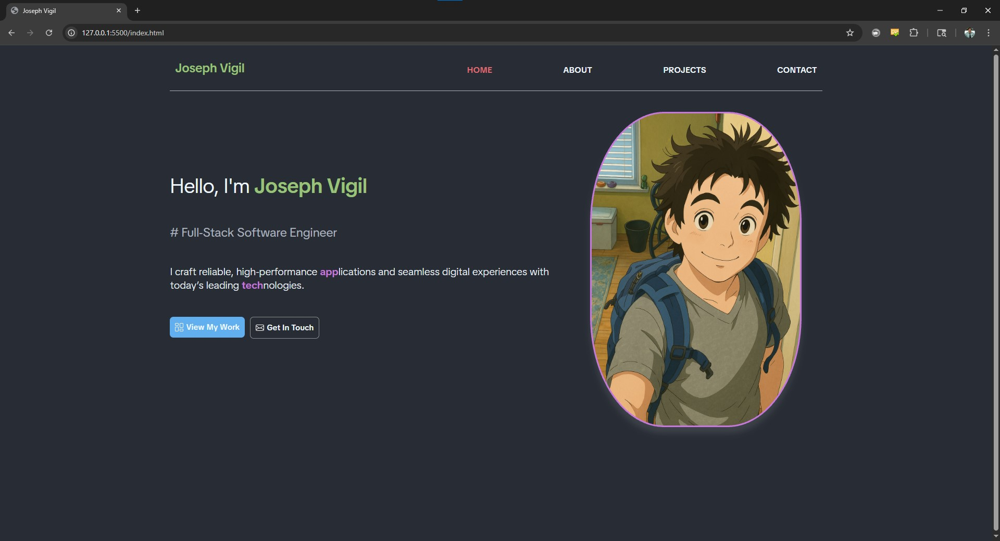

# hw4-portfolio-website

Portfolio Website for Coding Temple

<https://joeyvigil.github.io/hw4-portfolio-website/>



## Building Your Portfolio Website

## Learning Objectives

After completing this tutorial, you will be able to:

- Plan and structure a professional portfolio website
- Create essential HTML pages and components
- Apply effective CSS styling for a polished look
- Implement responsive design for all devices
- Deploy your website using GitHub Pages
- Organize project files and assets efficiently
- Create a compelling showcase of your work

## Planning Your Portfolio

### Basic Structure

- Your portfolio website should include:
- Homepage with introduction
- Projects page
- About page
- Contact information

### SKILLS

Frontend:
HTML5, CSS3, JAVASCRIPT, REACT, TYPESCRIPT, BOOTSTRAP, MUI, TAILWIND
Backend:
PYTHON, FLASK, SQL, API-DEVELOPMENT, FIREBASE, FIRESTORE

### File Organization

```text
portfolio-website/
├── index.html          # Homepage
├── projects.html       # Projects showcase
├── about.html         # About me
├── contact.html       # Contact information
├── css/
│   ├── style.css     # Your styles
│   └── about.css
└── images/           # Image assets
```

## Essential HTML Structure

### Base Template

```html
<!DOCTYPE html>
<html lang="en">
<head>
    <meta charset="UTF-8">
    <meta name="viewport" content="width=device-width, initial-scale=1.0">
    <title>Your Name - Web Developer</title>
    <link rel="stylesheet" href="css/normalize.css">
    <link rel="stylesheet" href="css/style.css">
</head>
<body>
    <!-- Navigation -->
    <header>
         <nav class="nav">
            <ul class="nav__list">
                <li><a href="index.html" class="nav__link">Home</a></li>
                <li><a href="projects.html" class="nav__link">Projects</a></li>
                <li><a href="about.html" class="nav__link">About</a></li>
                <li><a href="contact.html" class="nav__link">Contact</a></li>
            </ul>
        </nav>
    </header>

    <main>
        <!-- Page content -->
    </main>

    <footer>
        <!-- Footer content -->
    </footer>
</body>
</html>
```

### Navigation Menu

```html
<nav class="nav">
    <ul class="nav__list">
        <li><a href="index.html" class="nav__link">Home</a></li>
        <li><a href="projects.html" class="nav__link">Projects</a></li>
        <li><a href="about.html" class="nav__link">About</a></li>
        <li><a href="contact.html" class="nav__link">Contact</a></li>
    </ul>
</nav>
```

### Project Card Example

```html
<article class="project">
    
    
    <div class="project__content">
        <h3 class="project__title">Project Name</h3>
        <p class="project__description">
            Brief description of the project and your role.
        </p>
        <div class="project__links">
            <a href="#" class="button">View Project</a>
        </div>
    </div>
</article>
```

## CSS Styling Guide

### Essential Styles

```css
/* Base styles */
:root {
    --primary-color: #007bff;
    --text-color: #333;
    --background-color: #fff;
}

body {
    font-family: Arial, sans-serif;
    line-height: 1.6;
    color: var(--text-color);
    margin: 0;
}

/* Container */
.container {
    max-width: 1200px;
    margin: 0 auto;
    padding: 0 1rem;
}

/* Navigation */
.nav__list {
    display: flex;
    gap: 2rem;
    list-style: none;
    padding: 0;
}

.nav__link {
    text-decoration: none;
    color: var(--text-color);
}

/* Responsive navigation */
@media (max-width: 768px) {
    .nav__list {
        flex-direction: column;
        gap: 1rem;
    }
}

/* Projects grid */
.projects-grid {
    display: grid;
    grid-template-columns: repeat(auto-fit, minmax(300px, 1fr));
    gap: 2rem;
    padding: 2rem;
}

/* Project card */
.project {
    border: 1px solid #ddd;
    border-radius: 4px;
    overflow: hidden;
}

.project__image {
    width: 100%;
    height: auto;
}

.project__content {
    padding: 1rem;
}

/* Buttons */
.button {
    display: inline-block;
    padding: 0.5rem 1rem;
    background-color: var(--primary-color);
    color: white;
    text-decoration: none;
    border-radius: 4px;
}

.button:hover {
    background-color: #0056b3;
}
```

### Responsive Design Tips

Mobile-first approach
Simple breakpoints:

```css
/* Tablet */
@media (min-width: 768px) {
    /* Tablet styles */
}

/* Desktop */
@media (min-width: 1024px) {
    /* Desktop styles */
}
```

## GitHub Pages Deployment

### Step 1: Create Repository

Go to GitHub.com

Click "New Repository"

Name it: username.github.io

Make it public

Create repository

### Step 2: Upload Your Files

In your project folder

```git
git init
git add .
git commit -m "Initial portfolio website"
git remote add origin https://github.com/username/username.github.io.git
git push -u origin main
```

### Step 3: Enable GitHub Pages

Go to repository settings

Find "Pages" section

Select main branch

Save changes

Your site will be available at: <https://username.github.io>

## Common Issues & Solutions

### Images not loading

Use relative paths

Check file names and case sensitivity

Verify file extensions

### Styles not applying

Check file paths

Verify CSS file is linked

Clear browser cache

### Layout breaks on mobile

Add viewport meta tag

Use responsive units

Test on different devices

## Portfolio Content Tips

### Homepage

Clear introduction

Professional photo (optional)

Brief mission statement

### Projects Page

Best projects first or in order of relevance

Clear screenshots

Brief descriptions

Technologies used

Live demo links (if available)

### About Page

Professional summary

Skills list

Education/training

Interests/hobbies (optional)

### Contact Page

Email address

Social media links

Simple contact form (optional)

Location/timezone (optional)

### Resources

GitHub Pages Documentation

Google Fonts

Coolors Color Picker

Unsplash Free Images
